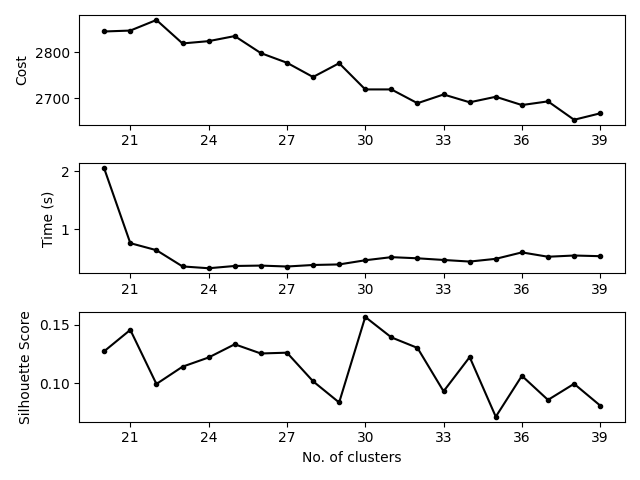

# Overview
**KabirRec** is a Python recommendation service that uses **surprise** and **scikit-learn**.

It has three main services:
- Cold Start Recommendation: Recomnends the most polular items
- Similar Items Recommendation: Recomnends similar items to the item given
- User Specific Recommendation: Recommends the best items to a user based on their history.

# Getting started
Its easy to use each service, first you need to create the RecommendationService object. Then read your csv data. We use ml-100k which has user info, user ratings, item info. We need to specify the columns as well as each csv seperators.
```
recommendation_service = RecommendationService()

recommendation_service.read_csv_data(
    user_info_path="../dataset/ml-100k/u.user",
    user_ratings_path="../dataset/ml-100k/u.data",
    item_info_path="../dataset/ml-100k/u.item",
    info_columns=["user_id", "age", "gender", "occupation", "zip_code"],
    ratings_columns=["user_id", "item_id", "rating", "timestamp"],
    item_columns=["movie_id", "movie_title", "release_date", "video_release_date", "imdb_url", "unknown",
    "action", "adventure", "animation", "children's", "comedy", "crime", "documentary",
    "drama", "fantasy", "film_noir", "horror", "musical", "mystery", "romance", "sci-fi",
    "thriller", "war", "western"],
    info_sep="|", ratings_sep="\t", item_sep="|"
)
```

Then you can call on generators for services to get the service object. First call the fit function and then you can use their prediction services.
## User Specific Example
```
user_specific = recommendation_service.user_specific_module(options={"verbose": True, "k": 26})
user_specific.fit(20, 30)
user_specific.draw_clusters_graph()
prediction_rating = user_specific.recommend(1, 4)
print(prediction_rating)
prediction_rating = user_specific.predict_rating(1, 1)
print(prediction_rating.est)
```
Output:
```
Fitting the algorithm...
Finding optimal cluster...
Optimal cluster k=23 found.
Clustering with k=23...
Clustering done.
Building tables...
Tables are built.
Fitting is done.
[(1189, 'Prefontaine (1997)', 5), (1500, 'Santa with Muscles (1996)', 5), (814, 'Great Day in Harlem, A (1994)', 5), (1536, 'Aiqing wansui (1994)', 5)]
3.603819651096398
```

## Similar Item Example
```
similar_items = recommendation_service.similar_items_module(options={"verbose": True})
similar_items.fit()
items = similar_items.recommend("Toy Story (1995)", k=5)
for movie in items:
    print(movie)
```
Output:
```
Fitting the algorithm...
Estimating biases using als...
Computing the pearson_baseline similarity matrix...
Done computing similarity matrix.
Fitting is done.
Finding 5 nearest items...
5 nearest items found.
Beauty and the Beast (1991)
Raiders of the Lost Ark (1981)
That Thing You Do! (1996)
Lion King, The (1994)
Craft, The (1996)
```
## Cold Start Example
```
cold_start = recommendation_service.cold_start_module(options {"verbose": True})
cold_start.fit()
items = cold_start.recommend(5)
print(items.head(5))
```
Output:
```
Ranking items...
All items are ranked.
     item_id  rating
49        50    2541
99       100    2111
180      181    2032
257      258    1936
173      174    1786
```
## More Information
For more information on how to use the library, look at comments in the codes.

# Installation
You can use pip (you'll need a C compiler and numpy library):
```
$ pip install kabirrec
```
You can also clone the repo and build the library:
```
$ pip install numpy cython
$ git clone https://github.com/smohammadhejazi/recommendation-as-a-service
$ cd recommendation-as-a-service
$ python setup.py install`
```


